# Ansible intro
*Note*
> When stopping (or extended pauses) the excercise, consider removing resources that might incurr costs.

- [Exercise Source code](https://github.com/dabble-be/ansible-intro)
- [Documentation](https://docs.ansible.com/ansible/latest/)


In this introduction into Configuration Management using Ansible, we'll discover the advantages of automating machine provisioning using Ansible's built-in abstractions. The purpose of this exercise is to demonstrate a few operations using Ansible's built-in DSL ([Domain-Specific Language](https://en.wikipedia.org/wiki/Domain-specific_language)).
We'll be providing a virtual machine with a custom nginx greeting page; Provisioned using Ansible.

This branch of the exercises' repository uses AWS's web console to create an instance ([Free tier eligible](https://aws.amazon.com/free/)). It requires you to create an Amazon AWS account. You can do so here: https://portal.aws.amazon.com/billing/signup#/start. The resulting wizard will guide you through account creation.

You'll require a valid payment method; We will only be using [Free tier eligible](https://aws.amazon.com/free/) instances in this exercise.

### Known example variables

| Variable | Value |
|----------|-------|
| Workspace | `/home/vincent/ansible-intro` |


## 1. Create a virtual machine (AWS EC2 Instance)

In this section we'll create a simple virtual machine using AWS's web console. Please refer to the below images as a reference.

### a. Find the EC2 instances menu
Amazon's Elastic Compute Cloud offers a huge range of options in its EC2 offering.

As shown below, there's a "Services" dropdown-menu you can open. In there's you'll find category "Compute", which holds "EC2". That's the one we are looking for.

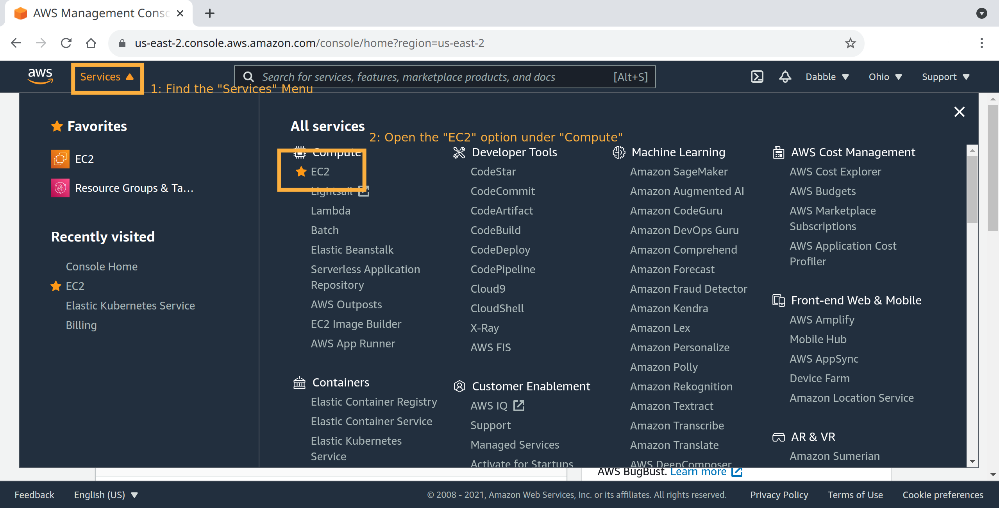

You're offered a new view: An overview of your current EC2 instances and related options, and, a big orange bar offering to: "Launch instances" (right hand top corner). 

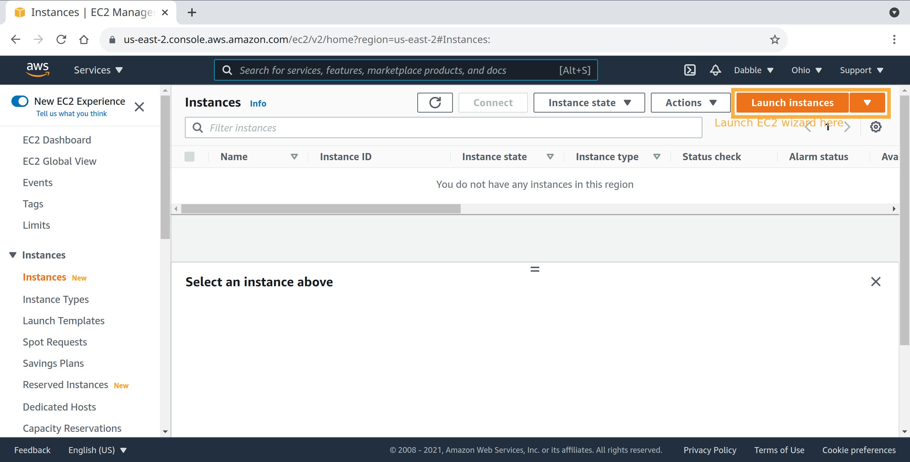

### b. Choose an Amazon Machine Image
Choose an Amazon Machine Image (AMI), to follow this guide, choose: "Ubuntu 20.04 LTS". There will be several options. I advise using an option explicitly labeled: "Free tier eligible".

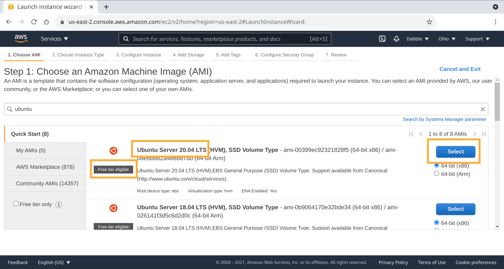

### c. Choose an Instance Type
This is the last decision we absolutely have to make before we can start our instance. Search for "micro" types. I advise using an option explicitly labeled: "Free tier eligible". Refer below for a visual reference.

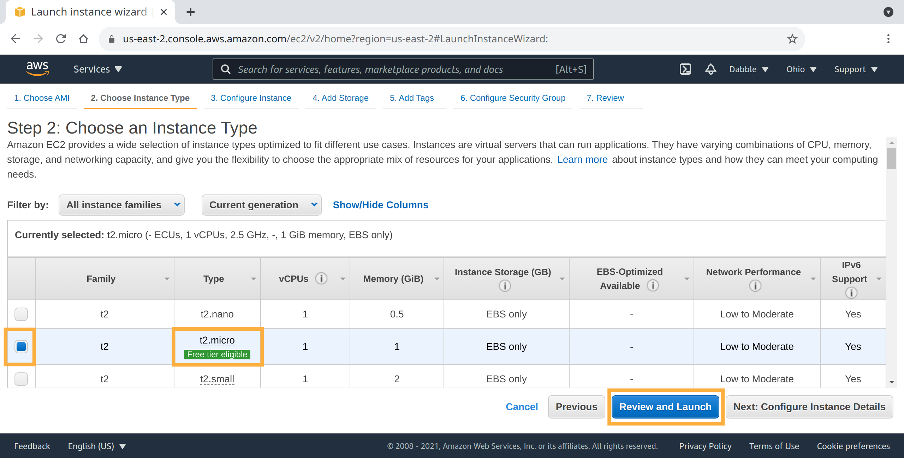

Find the "Review and Launch" button in the bottom bar right hand corner.

### d. Review instance Launch
This overview is the most important part of the wizard. It's a summary of your choices, and the defaults that require your attention. Don't launch yet!

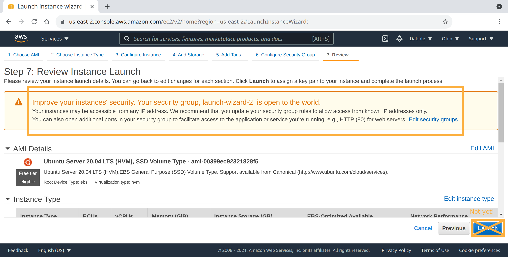

Scroll down and you'll see the following:

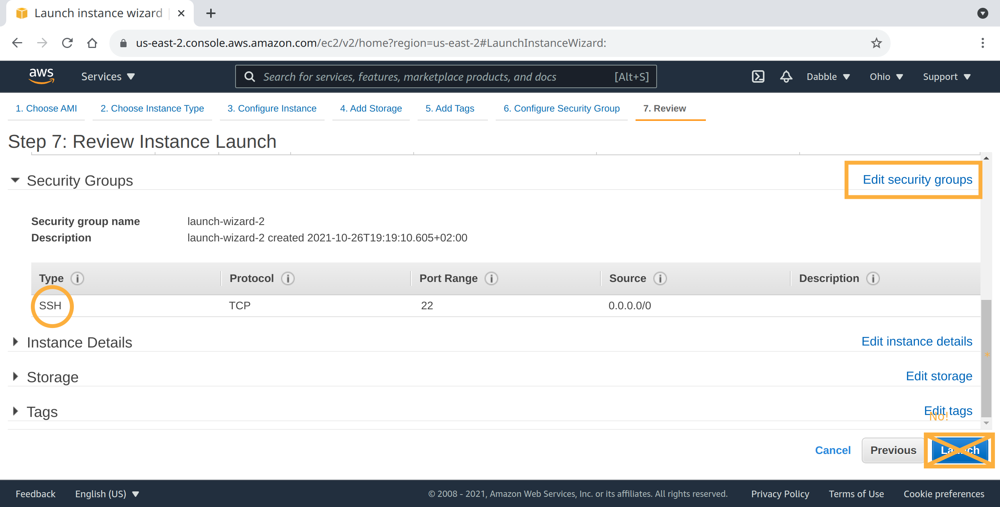

We are missing a port we'll need to view the fruits of our labor. If we want to reach our website lateron, we'll have to allow our firewall to open HTTP traffic.
Hit the "Edit security groups" button and continue on.

### e. Configure Security Group
You'll land in a view called: "Step 6: Configure Security Group". We'll create a new security group, name it and "Add Rule". Refer to the image for details.

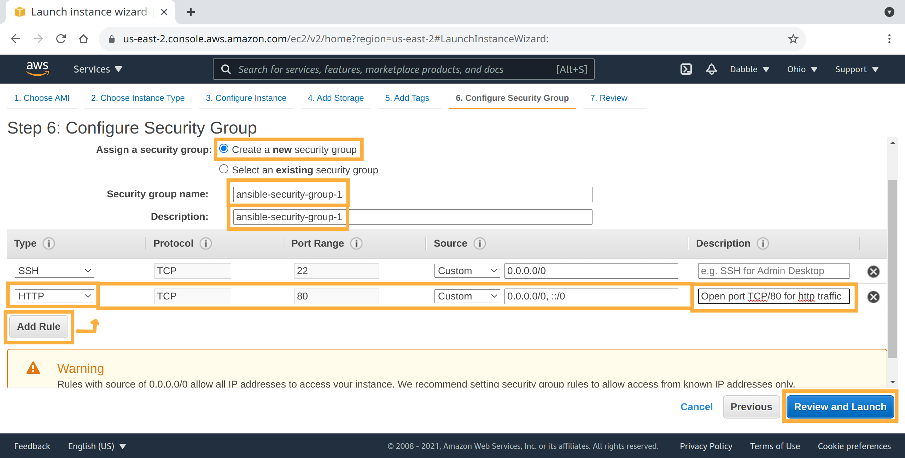

Once more, hit "Review and Launch" to land back in the review view.

### f. Review instance Launch (again)
The time has come to launch our new instance. 

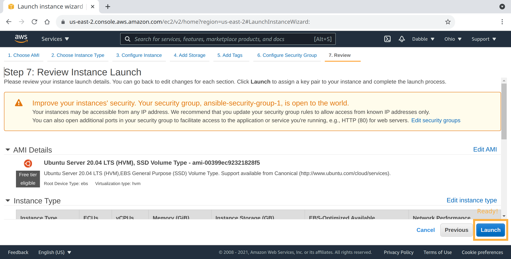

### g. Select an existing key pair or create a new key pair
You'll be greeted by a window, urging you to either choose an existing key pair, or create a new pair. For the sake of this introduction, we'll create a new pair and use it later to connect to our instance using ansible.

You can basically fill in anything from the available options here, for ideas, check the values in the next image.

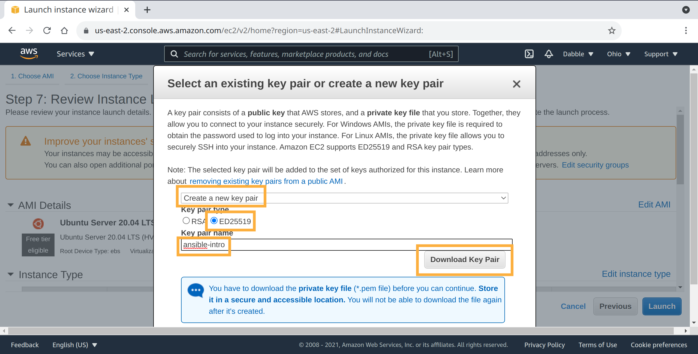

Click "Download Key Pair", once it's done, scroll down the popup and hit "Launch instances".

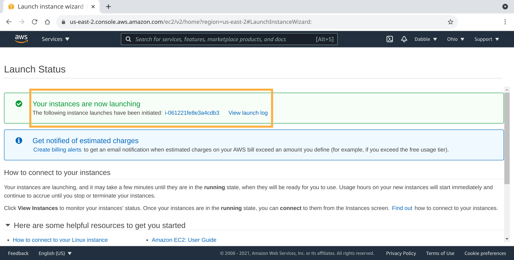

### z. Collect details for part 2: Ansible

Let's return to the EC2 instances overview page. After a few minutes, your new instance should be running.

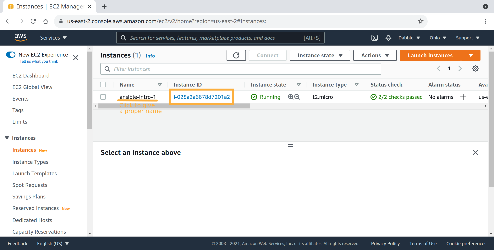

Find the instance and click its "Instance ID" to go to the details page. In the above image, I've opted to name the instance "ansible-intro-1"; By clicking the appropriate "Name" field.

Once we have our detailed view opened, we can collect the required details to continue to part 2 of this introduction.

There's 2 details we need to continue:
- External IP, or preferably a Public DNS address.
- The Private key we downloaded earlier.

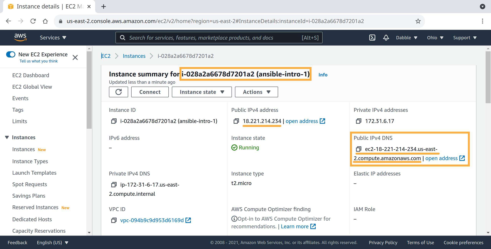

Public DNS address in this example's case is `ec2-18-221-214-234.us-east-2.compute.amazonaws.com`;

From a terminal:

```
host ec2-18-221-214-234.us-east-2.compute.amazonaws.com
```

_output:_

```
ec2-18-221-214-234.us-east-2.compute.amazonaws.com has address 18.221.214.234
```

Validates the example's DNS to IPv4 mapping.

The private key's location for the example will be: `/home/vincent/ansible-intro/intro.key`. Permissions are to be strictly set to user-only reads and writes.

```
chown -v $USER:$USER intro.key && chmod -v 0600 intro.key
```

_output:_

```
ownership of 'intro.key' retained as vincent:vincent
mode of 'intro.key' changed from 0664 (rw-rw-r--) to 0600 (rw-------)
```

We now have everything we need to introduce Ansible into this story. Let's!

#### Example details

| Variable | Value |
|----------|-------|
| Workspace | `/home/vincent/ansible-intro` |
| Private Key Path | `/home/vincent/ansible-intro/intro.key` |
| IPv4 DNS | `ec2-18-221-214-234.us-east-2.compute.amazonaws.com` |

## 2. Introduction: Ansible

### Preamble

Assuming Ansible is installed; In case there's debugging issues, this chapter has been performed with the following system details:

```
{ bash -version; echo -; ansible --version; echo -; jq --version; } | grep -iE -A99 -B99 'bash|ansible|jq'
```

_output_

```
GNU bash, version 5.0.17(1)-release (x86_64-pc-linux-gnu)
Copyright (C) 2019 Free Software Foundation, Inc.
License GPLv3+: GNU GPL version 3 or later <http://gnu.org/licenses/gpl.html>

This is free software; you are free to change and redistribute it.
There is NO WARRANTY, to the extent permitted by law.
-
ansible [core 2.11.6] 
  config file = /etc/ansible/ansible.cfg
  configured module search path = ['/home/vincent/.ansible/plugins/modules', '/usr/share/ansible/plugins/modules']
  ansible python module location = /usr/lib/python3/dist-packages/ansible
  ansible collection location = /home/vincent/.ansible/collections:/usr/share/ansible/collections
  executable location = /usr/bin/ansible
  python version = 3.8.10 (default, Sep 28 2021, 16:10:42) [GCC 9.3.0]
  jinja version = 2.10.1
  libyaml = True
-
jq-1.6
```

### a. Creating an Ansible inventory
Ansible is a simple configuration management and orchestration system. To identify the nodes we which to influence with the scripts we'll build, Ansible expects us to create an "inventory". We'll be doing this with a yaml file, like so:

```
read -rp "Address: "; cat <<EOF | tee inventory.yml
---
all:
  hosts:
    $REPLY
EOF
```

This will prompt for your address, which we gathered earlier in chapter 1. For this example, it would look like:

_output_

```
Address: ec2-18-221-214-234.us-east-2.compute.amazonaws.com
---
all:
  hosts:
    ec2-18-221-214-234.us-east-2.compute.amazonaws.com
```

The first line in our file `---` makes it easy to recognise a yaml file's beginning. After that we create group of hosts called `all` a pre-existing keyword to allow for `ungrouped` host lists.

Concretely: Our group `ungrouped (all)` contains 1 host.

### b. Creating an ansible playbook
To express demands for our infrastructure's configuration settings, ansible allows us to create a `yaml` file called a playbook.

Let's start off with a simple demand for the instance we made in the previous chapter:

```
cat <<EOF | tee playbook.yml
- hosts: all
  tasks:

    - name: create a marker in tmp filesystem
      command: "touch /tmp/a_rockstar_was_here"
EOF
```

Let's take a look at the different sections of this file (`playbook.yml`):

#### `playbook.yml`

This first part acts as a filter; The task list will be applied to all hosts in the `ungrouped` group (`aka: all`).

```
- hosts: all
  tasks:
```

Second part contains a single task:

```
    - name: create a marker in tmp filesystem
      command: "touch /tmp/a_rockstar_was_here"
```

The task is named `"create a marker in tmp filesystem"` and it uses the `command` module to execute `touch /tmp/a_rockstar_was_here` on the remote filesystem.

### c. Running the playbook

First off, let's make sure our new key is added to our ssh-agent for this session:

```
ssh-add ./intro.key
```

After all, Ansible will use our local ssh configuration by default to transport its data and instructions.

Let's see what happens when we execute the playbook now:

```
ansible-playbook -i inventory.yml playbook.yml -v
```

_output:_

```
Using /etc/ansible/ansible.cfg as config file

PLAY [all] *******************************************************************************************************************************************************************************************************************************************************************************

TASK [Gathering Facts] *******************************************************************************************************************************************************************************************************************************************************************
fatal: [ec2-18-221-214-234.us-east-2.compute.amazonaws.com]: UNREACHABLE! => {"changed": false, "msg": "Failed to create temporary directory.In some cases, you may have been able to authenticate and did not have permissions on the target directory. Consider changing the remote tmp path in ansible.cfg to a path rooted in \"/tmp\", for more error information use -vvv. Failed command was: ( umask 77 && mkdir -p \"` echo Please login as the user \"ubuntu\" rather than the user \"root\"./.ansible/tmp `\"&& mkdir \"` echo Please login as the user \"ubuntu\" rather than the user \"root\"./.ansible/tmp/ansible-tmp-1635344437.0892587-53037-2295337995719 `\" && echo ansible-tmp-1635344437.0892587-53037-2295337995719=\"` echo Please login as the user \"ubuntu\" rather than the user \"root\"./.ansible/tmp/ansible-tmp-1635344437.0892587-53037-2295337995719 `\" ), exited with result 142, stdout output: Please login as the user \"ubuntu\" rather than the user \"root\".\n\n", "unreachable": true}

PLAY RECAP *******************************************************************************************************************************************************************************************************************************************************************************
ec2-18-221-214-234.us-east-2.compute.amazonaws.com : ok=0    changed=0    unreachable=1    failed=0    skipped=0    rescued=0    ignored=0
```

Dear god! It seems AWS is doing something strange... Let's have a look. As behind the scenes, simple ssh is being used, we can see if we can get a more clear sense of the problem if we try using ssh directly:

```
ssh -i ./intro.key $REPLY
```

_output:_

```
Please login as the user "ubuntu" rather than the user "root".

Connection to ec2-18-221-214-234.us-east-2.compute.amazonaws.com closed.
```

That explains a lot. The ssh connection is closed after printing an informative message. This is a rather strange implementation detail, specific to AWS. Luckily, we can handle this in Ansible.

### d. Add an ssh user to our tasks

Let's make sure we use the ubuntu user when logging in using the ssh connection type in Ansible.

```
cat <<EOF | tee playbook.yml
---
- hosts: all
  remote_user: ubuntu
  tasks:

    - name: create a marker in tmp filesystem
      command: "touch /tmp/a_rockstar_was_here"
EOF
```

_output:_

```
---
- hosts: all
  remote_user: ubuntu
  tasks:

    - name: create a marker in tmp filesystem
      command: "touch /tmp/a_rockstar_was_here"

```

This adds the line `  remote_user: ubuntu`, telling ansible to use the ubuntu user to authenticate when connecting.
Let's run the playbook again, with confidence!

```
ansible-playbook -i inventory.yml playbook.yml -v
```

_output:_

```
Using /etc/ansible/ansible.cfg as config file

PLAY [all] *******************************************************************************************************************************************************************************************************************************************************************************

TASK [Gathering Facts] *******************************************************************************************************************************************************************************************************************************************************************
ok: [ec2-18-221-214-234.us-east-2.compute.amazonaws.com]

TASK [create a marker in tmp filesystem] *************************************************************************************************************************************************************************************************************************************************
changed: [ec2-18-221-214-234.us-east-2.compute.amazonaws.com] => {"changed": true, "cmd": ["touch", "/tmp/a_rockstar_was_here"], "delta": "0:00:00.003122", "end": "2021-10-27 14:35:25.924930", "msg": "", "rc": 0, "start": "2021-10-27 14:35:25.921808", "stderr": "", "stderr_lines": [], "stdout": "", "stdout_lines": []}

PLAY RECAP *******************************************************************************************************************************************************************************************************************************************************************************
ec2-18-221-214-234.us-east-2.compute.amazonaws.com : ok=2    changed=1    unreachable=0    failed=0    skipped=0    rescued=0    ignored=0   
```

There we go. Sweet sweet provisioning. If we log into the instance, the file has been created.

### e. Idempotency

Let's run the ansible playbook again, see what happens:

```
ansible-playbook -i inventory.yml playbook.yml -v
```

_output:_

```
Using /etc/ansible/ansible.cfg as config file

PLAY [all] *******************************************************************************************************************************************************************************************************************************************************************************

TASK [Gathering Facts] *******************************************************************************************************************************************************************************************************************************************************************
ok: [ec2-18-221-214-234.us-east-2.compute.amazonaws.com]

TASK [create a marker in tmp filesystem] *************************************************************************************************************************************************************************************************************************************************
changed: [ec2-18-221-214-234.us-east-2.compute.amazonaws.com] => {"changed": true, "cmd": ["touch", "/tmp/a_rockstar_was_here"], "delta": "0:00:00.003182", "end": "2021-10-27 14:39:27.855952", "msg": "", "rc": 0, "start": "2021-10-27 14:39:27.852770", "stderr": "", "stderr_lines": [], "stdout": "", "stdout_lines": []}

PLAY RECAP *******************************************************************************************************************************************************************************************************************************************************************************
ec2-18-221-214-234.us-east-2.compute.amazonaws.com : ok=2    changed=1    unreachable=0    failed=0    skipped=0    rescued=0    ignored=0
```

I don't like it. The file has been updated, with new metadata no less. We should make our task's demands more specific by requiring it to only execute the command if the file doesn't already exist.

Ansible's command module has extra arguments you can set to configure its behavior. To create the file only if it is missing, perform:

```
cat <<EOF | tee playbook.yml
---
- hosts: all
  remote_user: ubuntu
  tasks:

    - name: create a marker in tmp filesystem ONLY if it is missing
      command: "touch /tmp/a_rockstar_was_here"
      args:
        creates: "/tmp/a_rockstar_was_here"
EOF
```

_output:_

```
---
- hosts: all
  remote_user: ubuntu
  tasks:

    - name: create a marker in tmp filesystem ONLY if it is missing
      command: "touch /tmp/a_rockstar_was_here"
      args:
        creates: "/tmp/a_rockstar_was_here"
```

Next to adding more details to the task's name, we added the lines:

```
      args:
        creates: "/tmp/a_rockstar_was_here"
```

The `creates` option allows the command module to check if a file is already present and if so, skip executing the target command. It looks like so:

```
ansible-playbook -i inventory.yml playbook.yml -v
```

_output:_

```
Using /etc/ansible/ansible.cfg as config file

PLAY [all] *******************************************************************************************************************************************************************************************************************************************************************************

TASK [Gathering Facts] *******************************************************************************************************************************************************************************************************************************************************************
ok: [ec2-18-221-214-234.us-east-2.compute.amazonaws.com]

TASK [create a marker in tmp filesystem ONLY if it is missing] ***************************************************************************************************************************************************************************************************************************
ok: [ec2-18-221-214-234.us-east-2.compute.amazonaws.com] => {"changed": false, "cmd": ["touch", "/tmp/a_rockstar_was_here"], "delta": null, "end": null, "msg": "Did not run command since '/tmp/a_rockstar_was_here' exists", "rc": 0, "start": null, "stderr": "", "stderr_lines": [], "stdout": "skipped, since /tmp/a_rockstar_was_here exists", "stdout_lines": ["skipped, since /tmp/a_rockstar_was_here exists"]}

PLAY RECAP *******************************************************************************************************************************************************************************************************************************************************************************
ec2-18-221-214-234.us-east-2.compute.amazonaws.com : ok=2    changed=0    unreachable=0    failed=0    skipped=0    rescued=0    ignored=0
```

As we can see in the output: `"msg": "Did not run command since '/tmp/a_rockstar_was_here' exists",`. The `PLAY RECAP` confirms that all tasks where ok, and no resources where changed.

### f. Installing nginx

If we want to serve a page generated using Ansible, we'll need a webserver. This example shall use `nginx`: A powerful open source web server.

We could use `sudo apt update` and `sudo apt install nginx` in this case, but what if we have several to manage? To demonstrate the portability of Ansible Modules we'll be using the `package` module.
The module is aimed to be used transparently across multiple platforms and multiple package managers.

Let's *add* another task to our playbook:

```
cat <<EOF | tee --append playbook.yml

    - name: install nginx
      become: yes
      package:
      args:
        update_cache: yes
        name: nginx
        state: present
EOF
```

_output:_

```

    - name: install nginx
      become: yes
      package:
      args:
        update_cache: yes
        name: nginx
        state: present
```

As it's name implies, we'll be installing nginx in this task. As we are connecting to our instance using the `ubuntu` user, we'll want to become an administrator to execute the module's instructions. We do here: `      become: yes`, in this case, it will perform our `apt-get` commands preceded by `sudo`.

The package module is fed several arguments in this case:

- `update_cache` asks the module to update package source lists before performing the next operations.
- `name` sets the name of the package to install. Can also be passed a list of strings for multiple packages.
- `state` indicates if we want the package to be `present` (yes!), `absent` or in specific cases `latest`.

```
ansible-playbook -i inventory.yml playbook.yml -v
```

_output:_

```
Using /etc/ansible/ansible.cfg as config file

PLAY [all] *******************************************************************************************************************************************************************************************************************************************************************************************************************

TASK [Gathering Facts] *******************************************************************************************************************************************************************************************************************************************************************************************************
ok: [ec2-18-221-214-234.us-east-2.compute.amazonaws.com]

TASK [create a marker in tmp filesystem ONLY if it is missing] ***************************************************************************************************************************************************************************************************************************************************************
ok: [ec2-18-221-214-234.us-east-2.compute.amazonaws.com] => {"changed": false, "cmd": ["touch", "/tmp/a_rockstar_was_here"], "delta": null, "end": null, "msg": "Did not run command since '/tmp/a_rockstar_was_here' exists", "rc": 0, "start": null, "stderr": "", "stderr_lines": [], "stdout": "skipped, since /tmp/a_rockstar_was_here exists", "stdout_lines": ["skipped, since /tmp/a_rockstar_was_here exists"]}

TASK [install nginx] *********************************************************************************************************************************************************************************************************************************************************************************************************
changed: [ec2-18-221-214-234.us-east-2.compute.amazonaws.com] => {"cache_update_time": 1635351991, "cache_updated": true, "changed": true, "stderr": "", "stderr_lines": [], "stdout": "Reading package lists...\nBuilding dependency tree...\nReading state information...\nThe following additional packages will be installed:\n  fontconfig-config fonts-dejavu-core libfontconfig1 libgd3 libjbig0\n  libjpeg-turbo8 libjpeg8 libnginx-mod-http-image-filter\n  libnginx-mod-http-xslt-filter libnginx-mod-mail libnginx-mod-stream libtiff5\n  libwebp6 libxpm4 nginx-common nginx-core\nSuggested packages:\n  libgd-tools fcgiwrap nginx-doc ssl-cert\nThe following NEW packages will be installed:\n  fontconfig-config fonts-dejavu-core libfontconfig1 libgd3 libjbig0\n  libjpeg-turbo8 libjpeg8 libnginx-mod-http-image-filter\n  libnginx-mod-http-xslt-filter libnginx-mod-mail libnginx-mod-stream libtiff5\n  libwebp6 libxpm4 nginx nginx-common nginx-core\n0 upgraded, 17 newly installed, 0 to remove and 118 not upgraded.\nNeed to get 2432 kB of archives.\nAfter this operation, 7891 kB of additional disk space will be used.\nGet:1 http://us-east-2.ec2.archive.ubuntu.com/ubuntu focal/main amd64 fonts-dejavu-core all 2.37-1 [1041 kB]\nGet:2 http://us-east-2.ec2.archive.ubuntu.com/ubuntu focal/main amd64 fontconfig-config all 2.13.1-2ubuntu3 [28.8 kB]\nGet:3 http://us-east-2.ec2.archive.ubuntu.com/ubuntu focal/main amd64 libfontconfig1 amd64 2.13.1-2ubuntu3 [114 kB]\nGet:4 http://us-east-2.ec2.archive.ubuntu.com/ubuntu focal-updates/main amd64 libjpeg-turbo8 amd64 2.0.3-0ubuntu1.20.04.1 [117 kB]\nGet:5 http://us-east-2.ec2.archive.ubuntu.com/ubuntu focal/main amd64 libjpeg8 amd64 8c-2ubuntu8 [2194 B]\nGet:6 http://us-east-2.ec2.archive.ubuntu.com/ubuntu focal/main amd64 libjbig0 amd64 2.1-3.1build1 [26.7 kB]\nGet:7 http://us-east-2.ec2.archive.ubuntu.com/ubuntu focal-updates/main amd64 libwebp6 amd64 0.6.1-2ubuntu0.20.04.1 [185 kB]\nGet:8 http://us-east-2.ec2.archive.ubuntu.com/ubuntu focal-updates/main amd64 libtiff5 amd64 4.1.0+git191117-2ubuntu0.20.04.2 [162 kB]\nGet:9 http://us-east-2.ec2.archive.ubuntu.com/ubuntu focal/main amd64 libxpm4 amd64 1:3.5.12-1 [34.0 kB]\nGet:10 http://us-east-2.ec2.archive.ubuntu.com/ubuntu focal-updates/main amd64 libgd3 amd64 2.2.5-5.2ubuntu2.1 [118 kB]\nGet:11 http://us-east-2.ec2.archive.ubuntu.com/ubuntu focal-updates/main amd64 nginx-common all 1.18.0-0ubuntu1.2 [37.5 kB]\nGet:12 http://us-east-2.ec2.archive.ubuntu.com/ubuntu focal-updates/main amd64 libnginx-mod-http-image-filter amd64 1.18.0-0ubuntu1.2 [14.4 kB]\nGet:13 http://us-east-2.ec2.archive.ubuntu.com/ubuntu focal-updates/main amd64 libnginx-mod-http-xslt-filter amd64 1.18.0-0ubuntu1.2 [12.7 kB]\nGet:14 http://us-east-2.ec2.archive.ubuntu.com/ubuntu focal-updates/main amd64 libnginx-mod-mail amd64 1.18.0-0ubuntu1.2 [42.5 kB]\nGet:15 http://us-east-2.ec2.archive.ubuntu.com/ubuntu focal-updates/main amd64 libnginx-mod-stream amd64 1.18.0-0ubuntu1.2 [67.3 kB]\nGet:16 http://us-east-2.ec2.archive.ubuntu.com/ubuntu focal-updates/main amd64 nginx-core amd64 1.18.0-0ubuntu1.2 [425 kB]\nGet:17 http://us-east-2.ec2.archive.ubuntu.com/ubuntu focal-updates/main amd64 nginx all 1.18.0-0ubuntu1.2 [3620 B]\nPreconfiguring packages ...\nFetched 2432 kB in 0s (20.5 MB/s)\nSelecting previously unselected package fonts-dejavu-core.\r\n(Reading database ... \r(Reading database ... 5%\r(Reading database ... 10%\r(Reading database ... 15%\r(Reading database ... 20%\r(Reading database ... 25%\r(Reading database ... 30%\r(Reading database ... 35%\r(Reading database ... 40%\r(Reading database ... 45%\r(Reading database ... 50%\r(Reading database ... 55%\r(Reading database ... 60%\r(Reading database ... 65%\r(Reading database ... 70%\r(Reading database ... 75%\r(Reading database ... 80%\r(Reading database ... 85%\r(Reading database ... 90%\r(Reading database ... 95%\r(Reading database ... 100%\r(Reading database ... 60149 files and directories currently installed.)\r\nPreparing to unpack .../00-fonts-dejavu-core_2.37-1_all.deb ...\r\nUnpacking fonts-dejavu-core (2.37-1) ...\r\nSelecting previously unselected package fontconfig-config.\r\nPreparing to unpack .../01-fontconfig-config_2.13.1-2ubuntu3_all.deb ...\r\nUnpacking fontconfig-config (2.13.1-2ubuntu3) ...\r\nSelecting previously unselected package libfontconfig1:amd64.\r\nPreparing to unpack .../02-libfontconfig1_2.13.1-2ubuntu3_amd64.deb ...\r\nUnpacking libfontconfig1:amd64 (2.13.1-2ubuntu3) ...\r\nSelecting previously unselected package libjpeg-turbo8:amd64.\r\nPreparing to unpack .../03-libjpeg-turbo8_2.0.3-0ubuntu1.20.04.1_amd64.deb ...\r\nUnpacking libjpeg-turbo8:amd64 (2.0.3-0ubuntu1.20.04.1) ...\r\nSelecting previously unselected package libjpeg8:amd64.\r\nPreparing to unpack .../04-libjpeg8_8c-2ubuntu8_amd64.deb ...\r\nUnpacking libjpeg8:amd64 (8c-2ubuntu8) ...\r\nSelecting previously unselected package libjbig0:amd64.\r\nPreparing to unpack .../05-libjbig0_2.1-3.1build1_amd64.deb ...\r\nUnpacking libjbig0:amd64 (2.1-3.1build1) ...\r\nSelecting previously unselected package libwebp6:amd64.\r\nPreparing to unpack .../06-libwebp6_0.6.1-2ubuntu0.20.04.1_amd64.deb ...\r\nUnpacking libwebp6:amd64 (0.6.1-2ubuntu0.20.04.1) ...\r\nSelecting previously unselected package libtiff5:amd64.\r\nPreparing to unpack .../07-libtiff5_4.1.0+git191117-2ubuntu0.20.04.2_amd64.deb ...\r\nUnpacking libtiff5:amd64 (4.1.0+git191117-2ubuntu0.20.04.2) ...\r\nSelecting previously unselected package libxpm4:amd64.\r\nPreparing to unpack .../08-libxpm4_1%3a3.5.12-1_amd64.deb ...\r\nUnpacking libxpm4:amd64 (1:3.5.12-1) ...\r\nSelecting previously unselected package libgd3:amd64.\r\nPreparing to unpack .../09-libgd3_2.2.5-5.2ubuntu2.1_amd64.deb ...\r\nUnpacking libgd3:amd64 (2.2.5-5.2ubuntu2.1) ...\r\nSelecting previously unselected package nginx-common.\r\nPreparing to unpack .../10-nginx-common_1.18.0-0ubuntu1.2_all.deb ...\r\nUnpacking nginx-common (1.18.0-0ubuntu1.2) ...\r\nSelecting previously unselected package libnginx-mod-http-image-filter.\r\nPreparing to unpack .../11-libnginx-mod-http-image-filter_1.18.0-0ubuntu1.2_amd64.deb ...\r\nUnpacking libnginx-mod-http-image-filter (1.18.0-0ubuntu1.2) ...\r\nSelecting previously unselected package libnginx-mod-http-xslt-filter.\r\nPreparing to unpack .../12-libnginx-mod-http-xslt-filter_1.18.0-0ubuntu1.2_amd64.deb ...\r\nUnpacking libnginx-mod-http-xslt-filter (1.18.0-0ubuntu1.2) ...\r\nSelecting previously unselected package libnginx-mod-mail.\r\nPreparing to unpack .../13-libnginx-mod-mail_1.18.0-0ubuntu1.2_amd64.deb ...\r\nUnpacking libnginx-mod-mail (1.18.0-0ubuntu1.2) ...\r\nSelecting previously unselected package libnginx-mod-stream.\r\nPreparing to unpack .../14-libnginx-mod-stream_1.18.0-0ubuntu1.2_amd64.deb ...\r\nUnpacking libnginx-mod-stream (1.18.0-0ubuntu1.2) ...\r\nSelecting previously unselected package nginx-core.\r\nPreparing to unpack .../15-nginx-core_1.18.0-0ubuntu1.2_amd64.deb ...\r\nUnpacking nginx-core (1.18.0-0ubuntu1.2) ...\r\nSelecting previously unselected package nginx.\r\nPreparing to unpack .../16-nginx_1.18.0-0ubuntu1.2_all.deb ...\r\nUnpacking nginx (1.18.0-0ubuntu1.2) ...\r\nSetting up libxpm4:amd64 (1:3.5.12-1) ...\r\nSetting up nginx-common (1.18.0-0ubuntu1.2) ...\r\nCreated symlink /etc/systemd/system/multi-user.target.wants/nginx.service -> /lib/systemd/system/nginx.service.\r\nSetting up libjbig0:amd64 (2.1-3.1build1) ...\r\nSetting up libnginx-mod-http-xslt-filter (1.18.0-0ubuntu1.2) ...\r\nSetting up libwebp6:amd64 (0.6.1-2ubuntu0.20.04.1) ...\r\nSetting up fonts-dejavu-core (2.37-1) ...\r\nSetting up libjpeg-turbo8:amd64 (2.0.3-0ubuntu1.20.04.1) ...\r\nSetting up libjpeg8:amd64 (8c-2ubuntu8) ...\r\nSetting up libnginx-mod-mail (1.18.0-0ubuntu1.2) ...\r\nSetting up fontconfig-config (2.13.1-2ubuntu3) ...\r\nSetting up libnginx-mod-stream (1.18.0-0ubuntu1.2) ...\r\nSetting up libtiff5:amd64 (4.1.0+git191117-2ubuntu0.20.04.2) ...\r\nSetting up libfontconfig1:amd64 (2.13.1-2ubuntu3) ...\r\nSetting up libgd3:amd64 (2.2.5-5.2ubuntu2.1) ...\r\nSetting up libnginx-mod-http-image-filter (1.18.0-0ubuntu1.2) ...\r\nSetting up nginx-core (1.18.0-0ubuntu1.2) ...\r\nSetting up nginx (1.18.0-0ubuntu1.2) ...\r\nProcessing triggers for ufw (0.36-6) ...\r\nProcessing triggers for systemd (245.4-4ubuntu3.6) ...\r\nProcessing triggers for man-db (2.9.1-1) ...\r\nProcessing triggers for libc-bin (2.31-0ubuntu9.2) ...\r\n", "stdout_lines": ["Reading package lists...", "Building dependency tree...", "Reading state information...", "The following additional packages will be installed:", "  fontconfig-config fonts-dejavu-core libfontconfig1 libgd3 libjbig0", "  libjpeg-turbo8 libjpeg8 libnginx-mod-http-image-filter", "  libnginx-mod-http-xslt-filter libnginx-mod-mail libnginx-mod-stream libtiff5", "  libwebp6 libxpm4 nginx-common nginx-core", "Suggested packages:", "  libgd-tools fcgiwrap nginx-doc ssl-cert", "The following NEW packages will be installed:", "  fontconfig-config fonts-dejavu-core libfontconfig1 libgd3 libjbig0", "  libjpeg-turbo8 libjpeg8 libnginx-mod-http-image-filter", "  libnginx-mod-http-xslt-filter libnginx-mod-mail libnginx-mod-stream libtiff5", "  libwebp6 libxpm4 nginx nginx-common nginx-core", "0 upgraded, 17 newly installed, 0 to remove and 118 not upgraded.", "Need to get 2432 kB of archives.", "After this operation, 7891 kB of additional disk space will be used.", "Get:1 http://us-east-2.ec2.archive.ubuntu.com/ubuntu focal/main amd64 fonts-dejavu-core all 2.37-1 [1041 kB]", "Get:2 http://us-east-2.ec2.archive.ubuntu.com/ubuntu focal/main amd64 fontconfig-config all 2.13.1-2ubuntu3 [28.8 kB]", "Get:3 http://us-east-2.ec2.archive.ubuntu.com/ubuntu focal/main amd64 libfontconfig1 amd64 2.13.1-2ubuntu3 [114 kB]", "Get:4 http://us-east-2.ec2.archive.ubuntu.com/ubuntu focal-updates/main amd64 libjpeg-turbo8 amd64 2.0.3-0ubuntu1.20.04.1 [117 kB]", "Get:5 http://us-east-2.ec2.archive.ubuntu.com/ubuntu focal/main amd64 libjpeg8 amd64 8c-2ubuntu8 [2194 B]", "Get:6 http://us-east-2.ec2.archive.ubuntu.com/ubuntu focal/main amd64 libjbig0 amd64 2.1-3.1build1 [26.7 kB]", "Get:7 http://us-east-2.ec2.archive.ubuntu.com/ubuntu focal-updates/main amd64 libwebp6 amd64 0.6.1-2ubuntu0.20.04.1 [185 kB]", "Get:8 http://us-east-2.ec2.archive.ubuntu.com/ubuntu focal-updates/main amd64 libtiff5 amd64 4.1.0+git191117-2ubuntu0.20.04.2 [162 kB]", "Get:9 http://us-east-2.ec2.archive.ubuntu.com/ubuntu focal/main amd64 libxpm4 amd64 1:3.5.12-1 [34.0 kB]", "Get:10 http://us-east-2.ec2.archive.ubuntu.com/ubuntu focal-updates/main amd64 libgd3 amd64 2.2.5-5.2ubuntu2.1 [118 kB]", "Get:11 http://us-east-2.ec2.archive.ubuntu.com/ubuntu focal-updates/main amd64 nginx-common all 1.18.0-0ubuntu1.2 [37.5 kB]", "Get:12 http://us-east-2.ec2.archive.ubuntu.com/ubuntu focal-updates/main amd64 libnginx-mod-http-image-filter amd64 1.18.0-0ubuntu1.2 [14.4 kB]", "Get:13 http://us-east-2.ec2.archive.ubuntu.com/ubuntu focal-updates/main amd64 libnginx-mod-http-xslt-filter amd64 1.18.0-0ubuntu1.2 [12.7 kB]", "Get:14 http://us-east-2.ec2.archive.ubuntu.com/ubuntu focal-updates/main amd64 libnginx-mod-mail amd64 1.18.0-0ubuntu1.2 [42.5 kB]", "Get:15 http://us-east-2.ec2.archive.ubuntu.com/ubuntu focal-updates/main amd64 libnginx-mod-stream amd64 1.18.0-0ubuntu1.2 [67.3 kB]", "Get:16 http://us-east-2.ec2.archive.ubuntu.com/ubuntu focal-updates/main amd64 nginx-core amd64 1.18.0-0ubuntu1.2 [425 kB]", "Get:17 http://us-east-2.ec2.archive.ubuntu.com/ubuntu focal-updates/main amd64 nginx all 1.18.0-0ubuntu1.2 [3620 B]", "Preconfiguring packages ...", "Fetched 2432 kB in 0s (20.5 MB/s)", "Selecting previously unselected package fonts-dejavu-core.", "(Reading database ... ", "(Reading database ... 5%", "(Reading database ... 10%", "(Reading database ... 15%", "(Reading database ... 20%", "(Reading database ... 25%", "(Reading database ... 30%", "(Reading database ... 35%", "(Reading database ... 40%", "(Reading database ... 45%", "(Reading database ... 50%", "(Reading database ... 55%", "(Reading database ... 60%", "(Reading database ... 65%", "(Reading database ... 70%", "(Reading database ... 75%", "(Reading database ... 80%", "(Reading database ... 85%", "(Reading database ... 90%", "(Reading database ... 95%", "(Reading database ... 100%", "(Reading database ... 60149 files and directories currently installed.)", "Preparing to unpack .../00-fonts-dejavu-core_2.37-1_all.deb ...", "Unpacking fonts-dejavu-core (2.37-1) ...", "Selecting previously unselected package fontconfig-config.", "Preparing to unpack .../01-fontconfig-config_2.13.1-2ubuntu3_all.deb ...", "Unpacking fontconfig-config (2.13.1-2ubuntu3) ...", "Selecting previously unselected package libfontconfig1:amd64.", "Preparing to unpack .../02-libfontconfig1_2.13.1-2ubuntu3_amd64.deb ...", "Unpacking libfontconfig1:amd64 (2.13.1-2ubuntu3) ...", "Selecting previously unselected package libjpeg-turbo8:amd64.", "Preparing to unpack .../03-libjpeg-turbo8_2.0.3-0ubuntu1.20.04.1_amd64.deb ...", "Unpacking libjpeg-turbo8:amd64 (2.0.3-0ubuntu1.20.04.1) ...", "Selecting previously unselected package libjpeg8:amd64.", "Preparing to unpack .../04-libjpeg8_8c-2ubuntu8_amd64.deb ...", "Unpacking libjpeg8:amd64 (8c-2ubuntu8) ...", "Selecting previously unselected package libjbig0:amd64.", "Preparing to unpack .../05-libjbig0_2.1-3.1build1_amd64.deb ...", "Unpacking libjbig0:amd64 (2.1-3.1build1) ...", "Selecting previously unselected package libwebp6:amd64.", "Preparing to unpack .../06-libwebp6_0.6.1-2ubuntu0.20.04.1_amd64.deb ...", "Unpacking libwebp6:amd64 (0.6.1-2ubuntu0.20.04.1) ...", "Selecting previously unselected package libtiff5:amd64.", "Preparing to unpack .../07-libtiff5_4.1.0+git191117-2ubuntu0.20.04.2_amd64.deb ...", "Unpacking libtiff5:amd64 (4.1.0+git191117-2ubuntu0.20.04.2) ...", "Selecting previously unselected package libxpm4:amd64.", "Preparing to unpack .../08-libxpm4_1%3a3.5.12-1_amd64.deb ...", "Unpacking libxpm4:amd64 (1:3.5.12-1) ...", "Selecting previously unselected package libgd3:amd64.", "Preparing to unpack .../09-libgd3_2.2.5-5.2ubuntu2.1_amd64.deb ...", "Unpacking libgd3:amd64 (2.2.5-5.2ubuntu2.1) ...", "Selecting previously unselected package nginx-common.", "Preparing to unpack .../10-nginx-common_1.18.0-0ubuntu1.2_all.deb ...", "Unpacking nginx-common (1.18.0-0ubuntu1.2) ...", "Selecting previously unselected package libnginx-mod-http-image-filter.", "Preparing to unpack .../11-libnginx-mod-http-image-filter_1.18.0-0ubuntu1.2_amd64.deb ...", "Unpacking libnginx-mod-http-image-filter (1.18.0-0ubuntu1.2) ...", "Selecting previously unselected package libnginx-mod-http-xslt-filter.", "Preparing to unpack .../12-libnginx-mod-http-xslt-filter_1.18.0-0ubuntu1.2_amd64.deb ...", "Unpacking libnginx-mod-http-xslt-filter (1.18.0-0ubuntu1.2) ...", "Selecting previously unselected package libnginx-mod-mail.", "Preparing to unpack .../13-libnginx-mod-mail_1.18.0-0ubuntu1.2_amd64.deb ...", "Unpacking libnginx-mod-mail (1.18.0-0ubuntu1.2) ...", "Selecting previously unselected package libnginx-mod-stream.", "Preparing to unpack .../14-libnginx-mod-stream_1.18.0-0ubuntu1.2_amd64.deb ...", "Unpacking libnginx-mod-stream (1.18.0-0ubuntu1.2) ...", "Selecting previously unselected package nginx-core.", "Preparing to unpack .../15-nginx-core_1.18.0-0ubuntu1.2_amd64.deb ...", "Unpacking nginx-core (1.18.0-0ubuntu1.2) ...", "Selecting previously unselected package nginx.", "Preparing to unpack .../16-nginx_1.18.0-0ubuntu1.2_all.deb ...", "Unpacking nginx (1.18.0-0ubuntu1.2) ...", "Setting up libxpm4:amd64 (1:3.5.12-1) ...", "Setting up nginx-common (1.18.0-0ubuntu1.2) ...", "Created symlink /etc/systemd/system/multi-user.target.wants/nginx.service -> /lib/systemd/system/nginx.service.", "Setting up libjbig0:amd64 (2.1-3.1build1) ...", "Setting up libnginx-mod-http-xslt-filter (1.18.0-0ubuntu1.2) ...", "Setting up libwebp6:amd64 (0.6.1-2ubuntu0.20.04.1) ...", "Setting up fonts-dejavu-core (2.37-1) ...", "Setting up libjpeg-turbo8:amd64 (2.0.3-0ubuntu1.20.04.1) ...", "Setting up libjpeg8:amd64 (8c-2ubuntu8) ...", "Setting up libnginx-mod-mail (1.18.0-0ubuntu1.2) ...", "Setting up fontconfig-config (2.13.1-2ubuntu3) ...", "Setting up libnginx-mod-stream (1.18.0-0ubuntu1.2) ...", "Setting up libtiff5:amd64 (4.1.0+git191117-2ubuntu0.20.04.2) ...", "Setting up libfontconfig1:amd64 (2.13.1-2ubuntu3) ...", "Setting up libgd3:amd64 (2.2.5-5.2ubuntu2.1) ...", "Setting up libnginx-mod-http-image-filter (1.18.0-0ubuntu1.2) ...", "Setting up nginx-core (1.18.0-0ubuntu1.2) ...", "Setting up nginx (1.18.0-0ubuntu1.2) ...", "Processing triggers for ufw (0.36-6) ...", "Processing triggers for systemd (245.4-4ubuntu3.6) ...", "Processing triggers for man-db (2.9.1-1) ...", "Processing triggers for libc-bin (2.31-0ubuntu9.2) ..."]}

PLAY RECAP *******************************************************************************************************************************************************************************************************************************************************************************************************************
ec2-18-221-214-234.us-east-2.compute.amazonaws.com : ok=3    changed=1    unreachable=0    failed=0    skipped=0    rescued=0    ignored=0
```

That went awesome. Let's open our address in a browser.

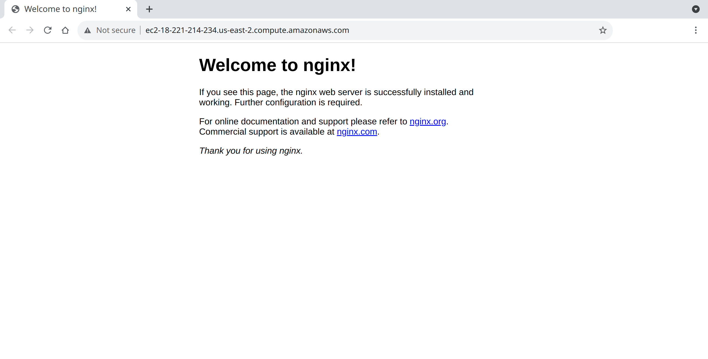

Looking good so far.

### g. Using the template module

It's time to customize the default landing page. We can do this by adding yet another task.

```
cat <<EOF | tee --append playbook.yml

    - name: customize greeting
      become: yes
      template:
        src: nginx-greeting.html
        dest: /var/www/html/index.html
        owner: root
        group: root
        mode: 0644
EOF
```

_output:_

```

    - name: customize greeting
      become: yes
      template:
        src: nginx-greeting.html
        dest: /var/www/html/index.html
        owner: root
        group: root
        mode: 0644
```

Taking a closer look at the task we added here, we are again using an administrator account.

The `template` module has the following arguments:

- `src`: Set to `nginx-greeting.html`. Ansible will look for a source _template_ file. Behind the scenes, Ansible will use a library called [`jinja`](https://jinja.palletsprojects.com/en/3.0.x/templates/) to parse the given source file; Like it does for both it's inventory files and playbooks.
- `dest`: Set to `/var/www/html/index.html`. This is the target file to create using the template file.
- `owner`, `group`, `mode`: These values set ownership and permissions for the target file.

Let us generate an example template for our default landing page. Behold:

```
cat <<EOF | tee nginx-greeting.html
<html>
	<head>
		<title>Learn Ansible</title>
	</head>
	<body>
		<div id="home">
			<h1>Home</h1>
			<p>This is the default landing page, for more details, contact: <span class="h2">{{ name }}</span>!</p>
		</section>
	</body>
</html>
EOF
```

_out:_

```
cat <<EOF | tee nginx-greeting.html
<html>
	<head>
		<title>Learn Ansible</title>
	</head>
	<body>
		<div id="home">
			<h1>Home</h1>
			<p>This is the default landing page, for more details, contact: <span class="h2">{{ name }}</span>!</p>
		</section>
	</body>
</html>
EOF
```

_out:_

```
<html>
<head>
<title>Learn Ansible</title>
</head>
<body>
<div id="home">
<h1>Home</h1>
<p>This is the default landing page, for more details, contact: <span class="h2">{{ name }}</span>!</p>
</section>
</body>
</html>
```

This will create the `nginx-greeting.html` file; With rudimentary contents and something eyecatching: `{{ name }}`. This is a placeholder for the `name` variable that will be set when generating the template.

Now all we need is a way to set that `name` variable. Let's go.

Variables can be defined pretty much any level in your configuration files. A useful way to set your variables is to set them at group level:

```
cat <<EOF | tee --append inventory.yml
>   vars:
>     name: $USER
> EOF
```

Feel free to customize `$USER` in this example to a fixed string; It will default to your current user.

_output:_

```
  vars:
    name: vincent
```

Any host we add to the `all` group in our inventory, will have that variable made available to it. Our template now has a name!

Run to see the profits of our trials:

```
ansible-playbook -i inventory.yml playbook.yml -v
```

_out:_

```
Using /etc/ansible/ansible.cfg as config file

PLAY [all] *********************************************************************************************************************************

TASK [Gathering Facts] *********************************************************************************************************************
ok: [ec2-18-221-214-234.us-east-2.compute.amazonaws.com]

TASK [create a marker in tmp filesystem ONLY if it is missing] *****************************************************************************
ok: [ec2-18-221-214-234.us-east-2.compute.amazonaws.com] => {"changed": false, "cmd": ["touch", "/tmp/a_rockstar_was_here"], "delta": null, "end": null, "msg": "Did not run command since '/tmp/a_rockstar_was_here' exists", "rc": 0, "start": null, "stderr": "", "stderr_lines": [], "stdout": "skipped, since /tmp/a_rockstar_was_here exists", "stdout_lines": ["skipped, since /tmp/a_rockstar_was_here exists"]}

TASK [install nginx] ***********************************************************************************************************************
ok: [ec2-18-221-214-234.us-east-2.compute.amazonaws.com] => {"cache_update_time": 1635363109, "cache_updated": true, "changed": false}

TASK [customize greeting] ******************************************************************************************************************
changed: [ec2-18-221-214-234.us-east-2.compute.amazonaws.com] => {"changed": true, "checksum": "4f6f3cb8db69337e3c687ec54b38532946c5e75a", "dest": "/var/www/html/index.html", "gid": 0, "group": "root", "md5sum": "d79eda5b21e488979baac1ae0f89e5fa", "mode": "0644", "owner": "root", "size": 216, "src": "/home/ubuntu/.ansible/tmp/ansible-tmp-1635363117.081764-75222-203587012271253/source", "state": "file", "uid": 0}

PLAY RECAP *********************************************************************************************************************************
ec2-18-221-214-234.us-east-2.compute.amazonaws.com : ok=4    changed=1    unreachable=0    failed=0    skipped=0    rescued=0    ignored=0   
```

Refresh the page to our instance.


Success!

###### References

- [Exercise Source code](https://github.com/dabble-be/ansible-intro)
- [Official Ansible Documentation](https://docs.ansible.com/ansible/latest/)
- [Jinja Template Engine (used by Ansible)](https://jinja.palletsprojects.com/en/3.0.x/templates/)
- [AWS Free Tier Documentation](https://aws.amazon.com/free/)

- [Asset attribution](.assets/README.md)
